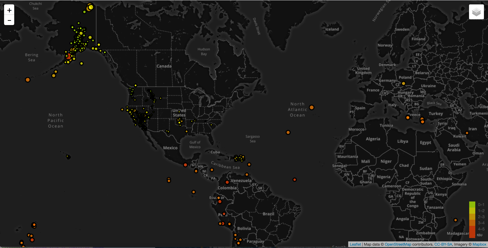

# EarthQuake

#### Description

[EarthQuake](https://github.com/janelcv/EarthQuake) is an interactive map which allows user to track the earthquakes happend for the last past week and the locations of the tectonic plates. 

Users are able to switch between 3 different types of maps:
1. Satellitemap
2. Darkmap
3. Streetmap

Also users are able to choose between 2 options to be desiplayes on a map:
1.  Earthquakes
2.  Tectonic Plates 

#### Result
It can be noticed from the map that a lot of earthquakes happen at the junction of tectonic plates.

